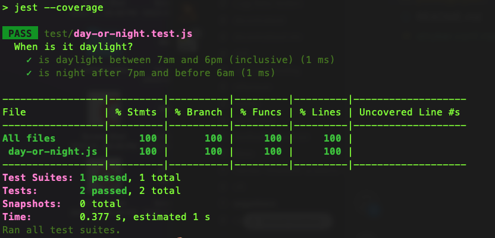

# Mutation-Testing-Demo
Example demo of using the Stryker mutation testing library in a node.js project with jest running the unit tests!

 

## Why It's Awesome
The word ___"mutation”___ in mutation testing is referring to a script that goes through each line of your source code and temporarily changes (ie. mutates) it in some way. Then the unit tests are run against each of these “mutant codebases”. We developers can then view the mutation testing output to become aware of the mutant cases where all tests still pass, and this pinpoints for us exact places in the code that we can add missing assertions for in our tests! 💡

 

## Inspired By Alex's Post
This project was inspired by [this great blog post](https://medium.com/@alexbunardzic/mutation-testing-for-javascript-e5e5ef7b5b) by [Alex Bunardzic](https://medium.com/@alexbunardzic) on this topic!

 

## Screenshots

 

#### Mutation Tests Output

 

#### Code Coverage Unit Tests Output

 